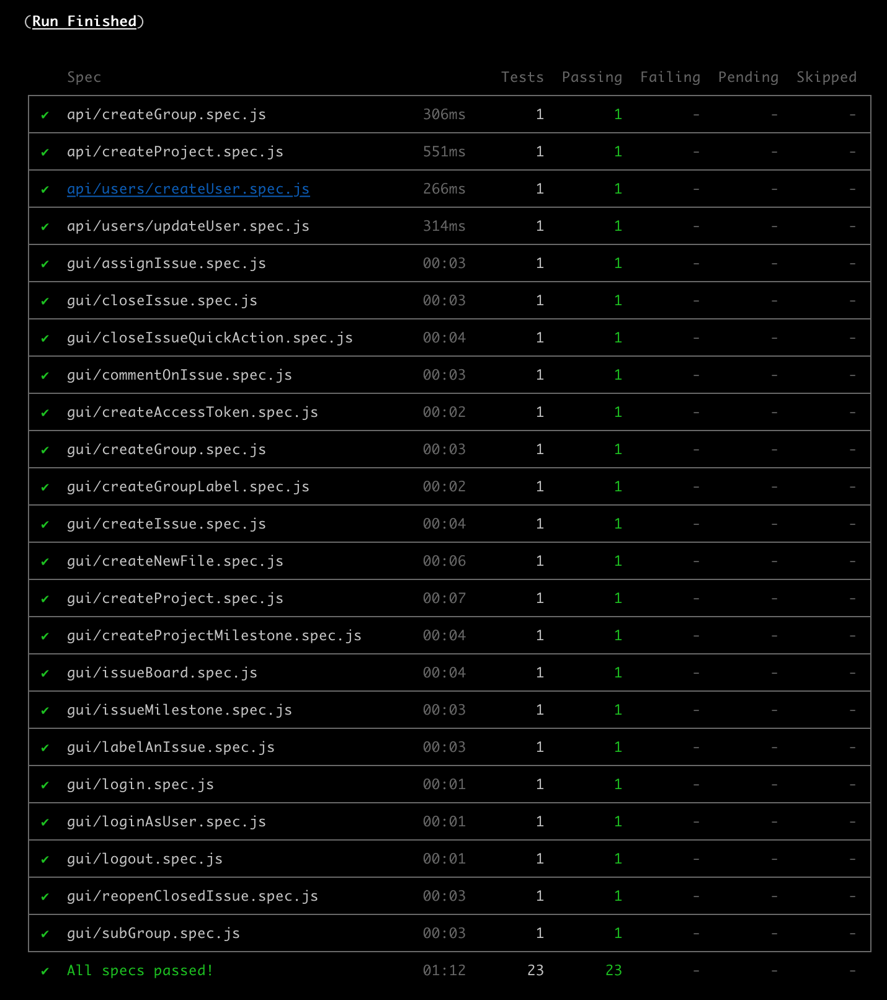

# GitLab Cypress

Sample project to experiment with Cypress for testing the GitLab application.

## Pre-requirements

You need to have a GitLab local environment such as [GDK](https://gitlab.com/gitlab-org/gitlab-development-kit) or Docker up and running.

You also need to have node and npm installed on your computer.

For this project the following versions of node and npm were used:

```sh
$ node -v
v12.13.0

$ npm -v
6.12.1
```

### Running GitLab on Docker

Run `docker run --publish 80:80 --name gitlab --hostname localhost wlsf82/gitlab-ce` and wait for the environment to be up and running (this might take a minute or so), then access http://localhost/, and finally, create a password for the `root` user.

## Installation

Run `npm i` to install the dev dependencies.

## Tests

> Before running the tests, create a file called `cypress.env.json` in the project root directory, based on `cypress.env.example.json`, and update the value of the `user_password` property with the credentials of the `root` user.

> After that, log in on your local GitLab environment and create an access token, then export it as an environment variable called `CYPRESS_GITLAB_ACCESS_TOKEN`. This token will be used by most of the tests.

> An easy way to create this tokern is to simply run the test `cypress/integration/createAccessToken.spec.js` in interactive mode (see below for instructions), and use the automatically created token to be exported as the environment variable.

> By default, the tests will run against `http://localhos/`, but if you need to run them in a different URL (e.g.: `http://localhos:3000/`), change the `baseUrl` property in the `cypress.json` file.

### Headless mode

Run `npm t` to run the tests in headless mode. The test results should look like the below image.



### Interactive mode

Run `npx cypress open`, then click 'Run all specs' to run the tests in interactive mode. You should see something like the below gif.


___

Made with 💚 by [Walmyr Filho](https://walmyr-filho.com)
